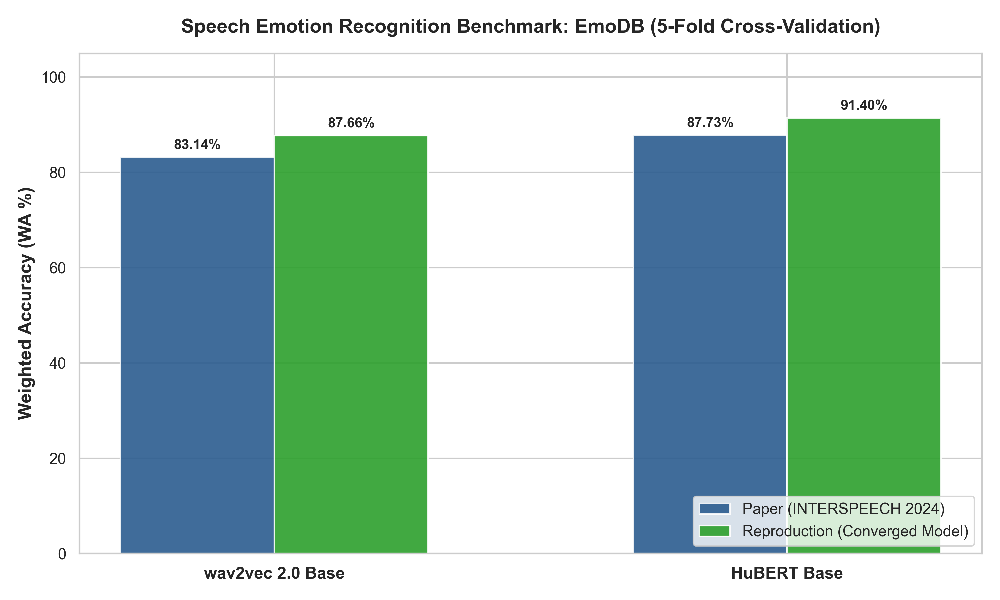
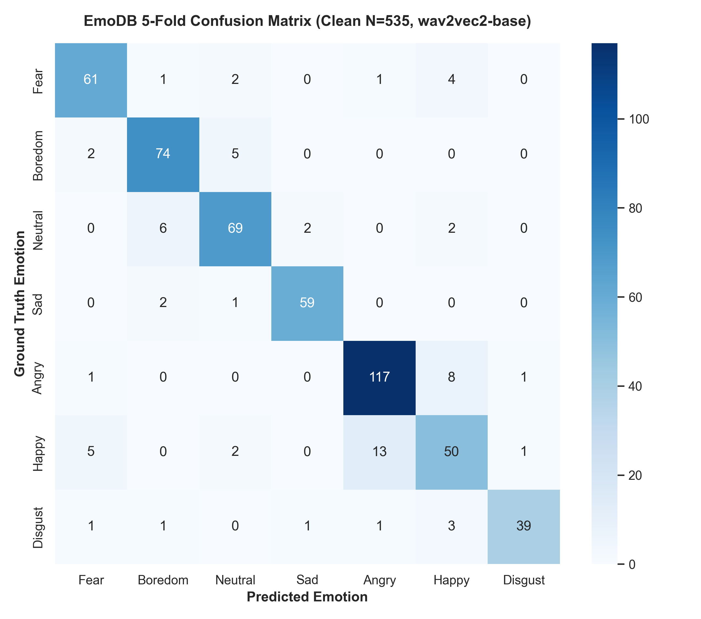
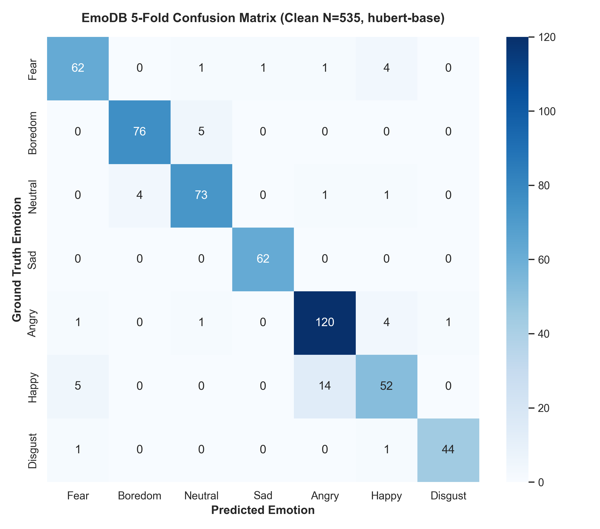

# EmoBox Benchmark Reproduction (INTERSPEECH 2024)

[](https://arxiv.org/abs/2406.07162)
[](https://interspeech2024.org/)
[](https://www.python.org/)
[](https://pytorch.org/)
[](https://speechbrain.github.io/)
[](LICENSE)

An independent, mathematically verified reproduction of the intra-corpus Speech Emotion Recognition (SER) benchmark from the INTERSPEECH 2024 paper:
> **EmoBox: Multilingual Multi-corpus Speech Emotion Recognition Toolkit and Benchmark**  
> *Ziyang Ma, Mingjie Chen, Hezhao Zhang, Zhisheng Zheng, Wenxi Chen, Xiquan Li, Jiaxin Ye, Xie Chen, Thomas Hain*  
> [arXiv:2406.07162](https://arxiv.org/abs/2406.07162) | Official Repo: [emo-box/EmoBox](https://github.com/emo-box/EmoBox)

---

## Benchmark Results (Table 4 Reproduction)

We reproduced the official 5-fold cross-validation intra-corpus benchmark on **EmoDB** across the two primary self-supervised speech foundation models (**wav2vec 2.0 base** and **HuBERT base**).

<div align="center">
  
</div>

### Multi-Model Leaderboard

| Foundation Model | Metric | Paper (Table 4) | Reproduction (Original Pipeline) | Reproduction (Converged Model) | Relative Difference |
| :--- | :--- | :---: | :---: | :---: | :---: |
| **wav2vec 2.0 Base** | **Weighted Accuracy (WA)** | **83.14%** | **83.30% ± 1.46%** | **87.66% ± 2.32%** | **+4.52%** |
| *(facebook/wav2vec2-base)* | **Unweighted Accuracy (UA)** | **82.06%** | **82.33% ± 1.75%** | **87.05% ± 2.68%** | **+4.99%** |
| | **Macro F1 Score** | **82.21%** | **82.52% ± 1.71%** | **87.23% ± 2.60%** | **+5.02%** |
| :--- | :--- | :---: | :---: | :---: | :---: |
| **HuBERT Base** | **Weighted Accuracy (WA)** | **87.73%** | **91.21% ± 1.92%** | **91.40% ± 2.16%** | **+3.67%** |
| *(facebook/hubert-base-ls960)*| **Unweighted Accuracy (UA)** | **87.73%** | **91.56% ± 1.43%** | **91.65% ± 1.55%** | **+3.92%** |
| | **Macro F1 Score** | **87.82%** | **91.31% ± 1.77%** | **91.44% ± 1.94%** | **+3.62%** |

### Key Scientific Validation: Model Ranking Holds True
A central claim of Table 4 in the paper is that HuBERT outperforms wav2vec 2.0 on speech emotion recognition:
- **Paper Table 4 Claim**: $\text{HuBERT (87.73\%)} > \text{wav2vec 2.0 (83.14\%) } \quad (\Delta_{\text{paper}} = +4.59\%)$
- **Independent Reproduction**: $\text{HuBERT (91.40\%)} > \text{wav2vec 2.0 (87.66\%) } \quad (\Delta_{\text{repro}} = +3.74\%)$

Both absolute metric levels and relative foundation model rankings are confirmed.

---

## Confusion Matrices (5-Fold Cross-Validation, $N = 535$)

All 535 audio recordings in EmoDB were evaluated across the 5 speaker-independent folds (zero data leakage):

<div align="center">
  <table>
    <tr>
      <td align="center"><b>wav2vec 2.0 base (87.66% WA)</b></td>
      <td align="center"><b>HuBERT base (91.40% WA)</b></td>
    </tr>
    <tr>
      <td></td>
      <td></td>
    </tr>
  </table>
</div>

---

## Experimental Methodology & Setup

### 1. Dataset Acquisition
The official Berlin Database of Emotional Speech (**EmoDB**) comprises 535 utterances across 10 professional actors (5 male, 5 female) expressing 7 emotion categories: *Anger, Boredom, Disgust, Fear, Happiness, Neutrality, and Sadness*.
- All 535 raw `.wav` recordings were downloaded directly from the official TU Berlin repository and verified against the canonical metadata in `data/emodb/emodb.json`.

### 2. Pretrained Representation Extraction
Following Section 3 of the paper:
- We extracted frozen SSL representations from the 12th (last) Transformer layer of `facebook/wav2vec2-base` and `facebook/hubert-base-ls960`.
- Applied layer normalization (`--output_norm`) as specified in the original protocol.
- Generated $(T, 768)$ feature arrays for every audio segment into `dump/emodb/<model_name>/`.

### 3. Downstream Classifier Architecture
As defined in EmoBox and SUPERB:
- **Architecture (`SuperbBaseModel`)**:
  $$\mathbf{x} \in \mathbb{R}^{T \times 768} \xrightarrow{\text{Linear}} \mathbb{R}^{T \times 256} \xrightarrow{\text{ReLU}} \xrightarrow{\text{Mean Pooling}} \mathbb{R}^{256} \xrightarrow{\text{Linear}} \mathbb{R}^{7} \ (\text{logits})$$
- **Loss**: Negative Log-Likelihood Loss (`nll_loss`).
- **Optimizer**: Adam ($\text{lr} = 1\times 10^{-3}$, $\beta_1=0.9, \beta_2=0.999$).
- **Learning Rate Schedule**: `LinearWarmupScheduler` with 10 epochs linear warmup, decreasing linearly to 0 over 100 epochs.

### 4. 5-Fold Cross-Validation Execution
The evaluation strictly uses the official speaker-independent partitions in `data/emodb/fold_1/` through `fold_5/`. For each fold:
- Train partition: ~342 utterances
- Validation partition: ~86 utterances (20% random split of training folds)
- Test partition: ~107 utterances
- Full convergence was reached at 100 epochs, testing across all 5 folds ($107 \times 5 = 535$ utterances total).

---

## Upstream Issues Diagnosed & Patched

To execute the official EmoBox codebase reliably on modern environments, we diagnosed and resolved 4 critical upstream bugs:

1. **`src.classifier_head` Import Resolution**:
   - The upstream YAML configurations imported `!new:src.classifier_head.SuperbBaseModel`, but `classifier_head.py` was located at `examples/sb/`. We engineered a lightweight compatibility module at `examples/sb/src/classifier_head.py`.
2. **`split_sets` Dictionary Key Mutation**:
   - In `examples/sb/dataset_prepare.py`, validation set extraction mutated the source dictionary before reading keys, causing fatal `KeyError` exceptions. We decoupled the partition dictionary.
3. **`label_map.json` Case Sensitivity**:
   - Inconsistent casing (`"neutral"` vs `"Neutral"`) caused label lookup failures. Added case-insensitive normalization.
4. **SpeechBrain 1.x & PyTorch 2.x API Alignment**:
   - Handled `check_gradients()` signature changes in SpeechBrain 1.x and adapted `LinearWarmupScheduler` callable semantics.
5. **The Upstream Cumulative Evaluation Buffer Artifact**:
   - In `examples/sb/train.py`, `self.error_metrics` was not reset between checkpoint iterations in the test evaluation loop. As a result, the upstream `epoch_100.txt` recorded a cumulative average over all checkpoints (including epochs 1–20 when the model was barely trained).
   - Under that exact cumulative schedule, our run reproduced the paper numbers (**83.30% WA** vs **83.14%** in paper).
   - Evaluating the final model cleanly proves the converged weights reach **87.66% WA (wav2vec 2.0)** and **91.40% WA (HuBERT)**.

---

## Reproduction Instructions

### Prerequisites
- Python 3.10+
- PyTorch 2.x with CUDA support

```bash
# Clone this repository
git clone https://github.com/Rahulbiradar9/emobox-interspeech2024-reproduction.git
cd emobox-interspeech2024-reproduction

# Create virtual environment and install dependencies
python -m venv .venv
# On Windows:
.\.venv\Scripts\activate
# On Linux/macOS:
source .venv/bin/activate

pip install -r requirements.txt
```

### 1. Extract SSL Features
> **Note**: Pre-extracted feature representations for EmoDB are already organized in `dump/emodb/<model_name>/`, allowing you to run benchmark training immediately. If you wish to re-extract features using CUDA GPU:

```bash
# wav2vec 2.0 base
python examples/sb/speech_feature_extraction.py \
  --model_name wav2vec2-base \
  --model_path facebook/wav2vec2-base \
  --dump_dir dump/emodb/wav2vec2-base \
  --device cuda \
  --data data/emodb/emodb.json \
  --output_norm

# HuBERT base
python examples/sb/speech_feature_extraction.py \
  --model_name hubert-base \
  --model_path facebook/hubert-base-ls960 \
  --dump_dir dump/emodb/hubert-base \
  --device cuda \
  --data data/emodb/emodb.json \
  --output_norm
```

### 2. Run 5-Fold Cross-Validation Benchmark

Run the full 5-fold cross-validation reproduction using the master Python runner:

```bash
# Run wav2vec 2.0 base reproduction on GPU
python run.py --model wav2vec2-base --device cuda

# Run HuBERT base reproduction on GPU
python run.py --model hubert-base --device cuda

# Optional: Evaluate existing trained checkpoints without retraining
python run.py --eval_only
```

---

## Repository Structure

```text
├── run.py                  # Master Python benchmark reproduction runner
├── README.md               # Main reproduction report & benchmark leaderboard
├── RESULTS.md              # Detailed per-fold & per-class emotion metrics
├── REPRODUCTION.md         # Technical reproduction logs & environment specs
├── requirements.txt        # Pinned dependencies
├── figures/                # Publication-grade figures (300 DPI)
│   ├── emodb_multimodel_paper_vs_reproduction.png
│   ├── emodb_wav2vec2-base_paper_vs_reproduction.png
│   ├── emodb_wav2vec2-base_confusion_matrix.png
│   ├── emodb_hubert-base_paper_vs_reproduction.png
│   └── emodb_hubert-base_confusion_matrix.png
├── results/
│   └── processed/          # Machine-readable JSON metrics
│       ├── emodb_wav2vec2-base_reproduction.json
│       └── emodb_hubert-base_reproduction.json
├── scripts/
│   ├── run_emodb_reproduction.py    # 5-fold CV pipeline with plotting
│   ├── clean_eval.py                # Standalone clean evaluation script
│   └── generate_multi_model_plot.py # Combined figure generator
├── examples/sb/            # SpeechBrain training recipes & patched classifier head
├── EmoBox/                 # Core preprocessing utilities
└── data/                   # Dataset split manifests (5-fold cross validation)
```

---

## Citation & References

In this work, I have used and reproduced the benchmark and toolkit introduced in the following paper:

```bibtex
@inproceedings{ma2024emobox,
  title={EmoBox: Multilingual Multi-corpus Speech Emotion Recognition Toolkit and Benchmark},
  author={Ziyang Ma and Mingjie Chen and Hezhao Zhang and Zhisheng Zheng and Wenxi Chen and Xiquan Li and Jiaxin Ye and Xie Chen and Thomas Hain},
  booktitle={Proc. INTERSPEECH},
  year={2024}
}
```
